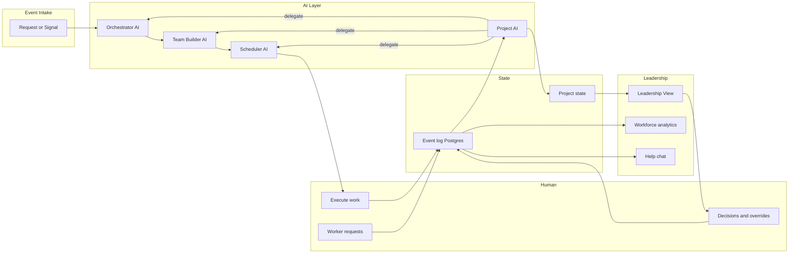

# Architecture

High-level architecture of the AI-Native Organization System and the core loop.

---

## Overview

The system is built around **one loop**: request → orchestration → assignment → scheduling → execution → events → Project AI coordination → leadership clarity → replan when needed. Supporting systems (workforce analytics, help chat, worker portal) read the same event-backed store.

---

## Core loop (flow)

---

## Components

| Component | Responsibility |
|-----------|----------------|
| **Event intake** (`routes/events.js`) | Validate, persist, SSE, route by type |
| **Orchestrator AI** | Plans from requests; tasks, risk, needs |
| **Team Builder AI** | Assignments with rationale; skips `on_leave` |
| **Scheduler AI** | Proposed timelines per task |
| **Project AI** | Status assessment, periodic polls, delegates via `agentActions` |
| **Org AI** | Org-wide insights (`routes/orgInsights.js`) |
| **Assignment gap fill** | Team Builder + Scheduler for unassigned tasks only |
| **Workforce analytics** | Explainable indexes from tasks, events, requests, leave |
| **Help chat** | LLM Q&A with full org + workforce snapshot |
| **Worker Portal API** (`routes/worker.js`) | Dashboard, status, requests, HR, emergency return |
| **Postgres store** | Events, project state, people, needs |
| **Leadership View** | Read-mostly UI + event submission |
| **Worker Portal** | Separate React app for contributors |

---

## Data flow

1. **Inbound:** Event POSTed to `/events` or `/worker/*`.
2. **Validate & persist:** Append to event log; apply to in-memory project state; save to Postgres.
3. **Route by type:**
   - `request` → `handleRequestFlow` (Orchestrator → Team Builder → Scheduler)
   - Other types → `applyEvent` only
   - Human `execution` → may trigger gap fill, replan (blocked), Project AI check
4. **Project AI:** Debounced status check; may emit `project_assessment` and run `projectAIActions` (assign, reschedule, replan, need).
5. **SSE:** Broadcast to Leadership and Worker clients.
6. **Read paths:** Leadership/Worker UIs, `/workforce/analytics`, `/help-chat`, `/org-insights`.

---

## Project AI coordination

Project AI sits **above** the tier-1–3 pipeline for ongoing monitoring:

| Trigger | Examples |
|---------|----------|
| Events | `execution`, `plan_created`, `assignment`, `schedule_proposed`, `need` |
| Poll | `PROJECT_AI_POLL_INTERVAL_MS` (default 5 min) |
| Skipped | Own `project_assessment` decisions (avoid loops) |

After assessment, `executeAgentActions` may invoke:

- `fillAssignmentGaps` → Team Builder + Scheduler
- `rescheduleTasks` → Scheduler
- `triggerReplan` → system `request` + `handleRequestFlow`

---

## Worker request flow

1. Worker submits `need` (`source: human`) via Worker Portal.
2. `workerRequestHandler` routes by kind (`requestRouting.js`): roles, AI agent, handling mode.
3. AI mode may create review tasks via Team Builder.
4. HR or project reviewers PATCH status via Worker or Leadership APIs.
5. `workerRequestEffects` on approve: leave, unassignment, transfer, etc.

---

## Invariants

- **State is only updated via events.**
- **AI-generated events include rationale** where applicable.
- **Replanning reuses the same orchestration pipeline.**
- **Workforce indexes are derived metrics**, not hidden scoring of individuals.

See [event-model.md](event-model.md) and [orchestration-loop.md](orchestration-loop.md).
