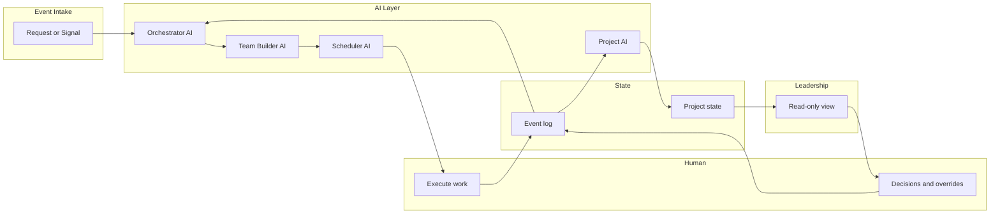

# Architecture

High-level architecture of the AI-Native Organization System and the core loop.

---

## Overview

The system is built around **one loop**: request/signal → orchestration → assignment → scheduling → execution → events → state update → leadership clarity → replan when needed. All components exist to keep this loop intact.

---

## Core loop (flow)

---

## Components

| Component | Responsibility |
|-----------|----------------|
| **Event Intake** | Accepts structured events (request, assignment, execution, decision). Validates and persists to event log. |
| **Orchestrator AI** | Breaks high-level requests into sub-tasks; estimates risk and impact; outputs structured plan (JSON). |
| **Team Builder AI** | Selects people by skill, load, project relevance; emits assignments with rationale. |
| **Scheduler AI** | Proposes timelines and task ordering; respects availability (mocked in MVP). |
| **Project AI** | Owns project truth. Updates state only by applying events (progress, risk, blockers, dependencies). |
| **Event log** | Append-only store of all events. Source of truth for replay and audit. |
| **Project state** | Materialized view per project; derived from events. Read by Leadership view and by AI for context. |
| **Leadership view** | Read-only. Shows what is happening, why, and what changed. No micromanagement. |

---

## Data flow

1. **Inbound:** A `request` event (or other event type) is POSTed to the intake.
2. **Validate & persist:** Event is validated against the base schema and appended to the event log.
3. **Route:** By `event.type`, the system either runs the request pipeline (Orchestrator → Team Builder → Scheduler) or applies the event to state (Project AI).
4. **Apply:** Project AI loads current project state, applies the event (and any newly emitted events), and persists updated state.
5. **Outbound:** Leadership view reads project state (and optionally recent events). No write path from the view.

---

## Invariants

- **State is only updated via events.** No direct writes to project state from outside the apply logic.
- **AI-generated events include rationale.** Required for transparency.
- **Replanning reuses the same loop.** Emit a new request (or replan event) with context; Orchestrator runs again.

See [event-model.md](event-model.md) for schemas and [orchestration-loop.md](orchestration-loop.md) for pseudocode.
