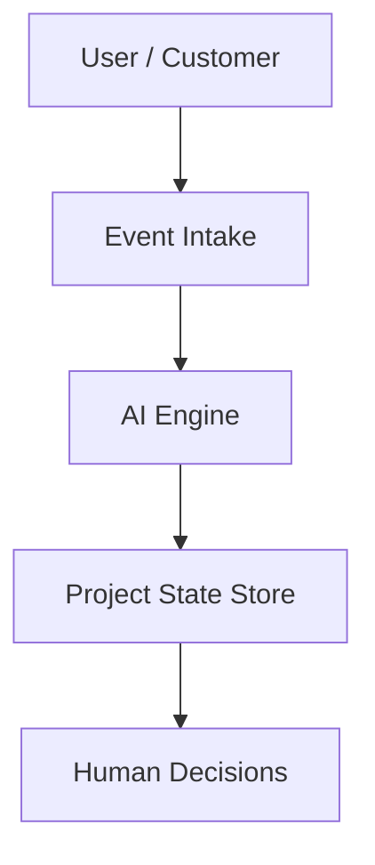

# System Architecture Overview

## High-Level Goal

Create a centralized AI-driven system that:

- Processes organizational signals
- Maintains real-time project context
- Minimizes coordination overhead

---

## Core Components

### 1. Event Intake Layer

Receives all inputs as structured events:

- Employee updates
- Customer issues
- System notes (mocked in MVP)

Each event includes:

- Source
- Timestamp
- Payload
- Related project (if known)

---

### 2. AI Processing Engine

The AI engine is responsible for:

- **Classification**
    - Bug / feature request / usability issue
    - Internal vs external signal
- **Evaluation**
    - Severity
    - Urgency
    - Impact scope
- **Routing**
    - Maps events to project AIs
    - Escalates when thresholds are crossed
- **Summarization**
    - Maintains current project state
    - Generates leadership-level summaries

---

### 3. Project AI (Logical Unit)

Each project has a logical AI instance that:

- Tracks its own state
- Understands dependencies
- Maintains risk level
- Receives routed events

> **Note:** This is not a microservice — it is a conceptual boundary.

---

### 4. State Store

Stores:

- Project state
- Event history
- AI evaluations

This allows:

- Traceability
- Debugging
- Transparency

---

### 5. Human Interface Layer

Provides:

- Employee update forms
- Customer issue submission
- Leadership overview

_Read-only for leadership in MVP._

---

## Architecture Diagram (Conceptual)

---

## What This Architecture Avoids

- Manual status reporting
- Ticket triage queues
- Siloed tools
- Sync-heavy workflows
